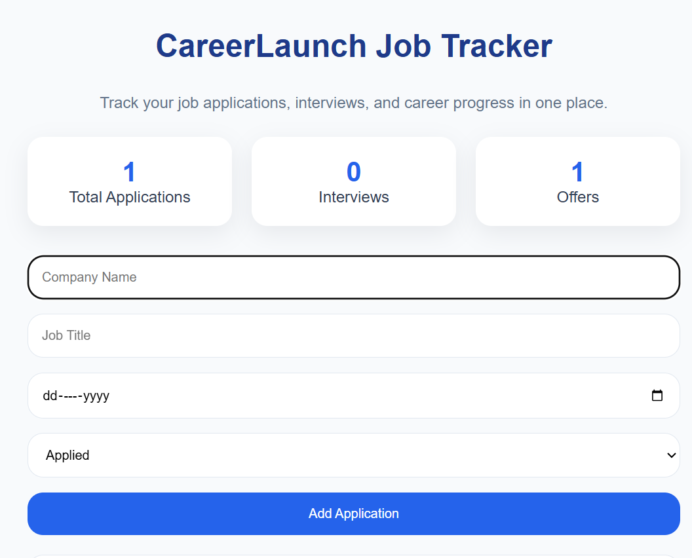
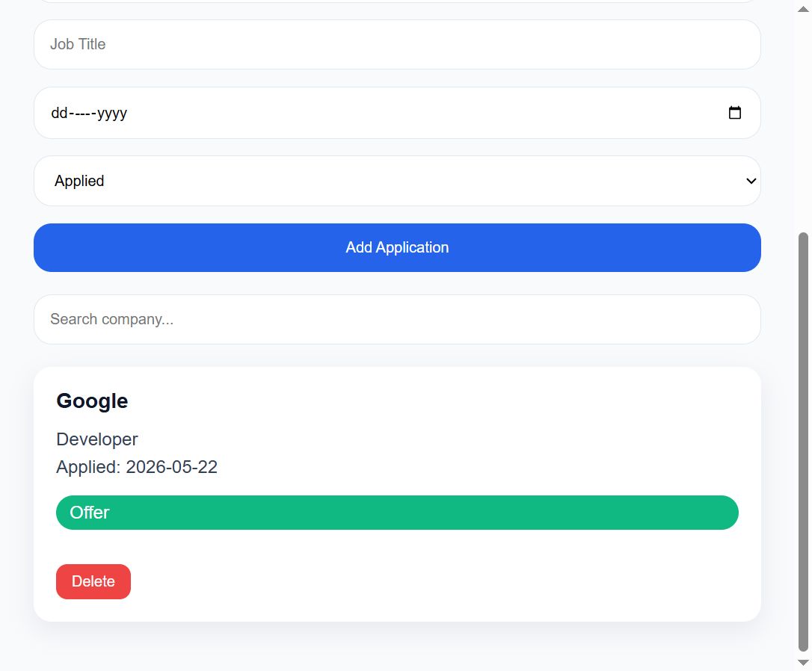
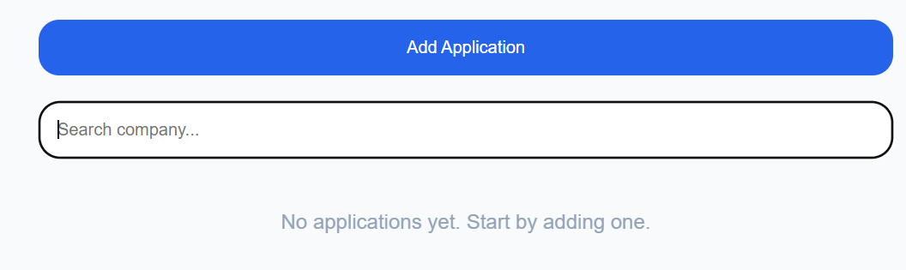

📌 About the project:

CareerLaunch is a simple job tracking web app I built to help organize job applications in one place.
It lets you add jobs you’ve applied to, track their status, and quickly see where you stand in your job search.
It’s built with just HTML, CSS, and JavaScript, and uses localStorage so data doesn’t disappear when you refresh the page.

✨ What it does
   
- Add job applications (company, role, date, status)
- View all applications in a clean dashboard
- Delete applications when needed
- Track status (Applied, Interview, Offer, Rejected)
- Search by company name
- Simple stats (total, interviews, offers)
- Shows a message when there are no applications yet

🛠️ Built with
- HTML
- CSS
- JavaScript
- localStorage

📷 Preview
### Dashboard

### Application Feature

### Empty State

🌐 Live link

👉 https://lucyannnjeri.github.io/careerlaunch/

📁 Folder structure

careerlaunch/
├── index.html
├── style.css
└── script.js
└── assets/
    └── screenshots/

🧠 What I learned

- Working with JavaScript arrays and objects
- DOM manipulation
- Handling form inputs
- Saving data using localStorage
- Updating UI dynamically
- Basic UI/UX thinking (empty states, feedback, etc.)

🚀 What I want to improve next

- Add edit functionality for applications
- Better mobile responsiveness
- Possibly connect it to a backend later

👩‍💻 Author
- Lucy Ann Njeri
- Frontend Developer / UI-UX Designer

⭐ Note

Still improving this project as I learn more.
